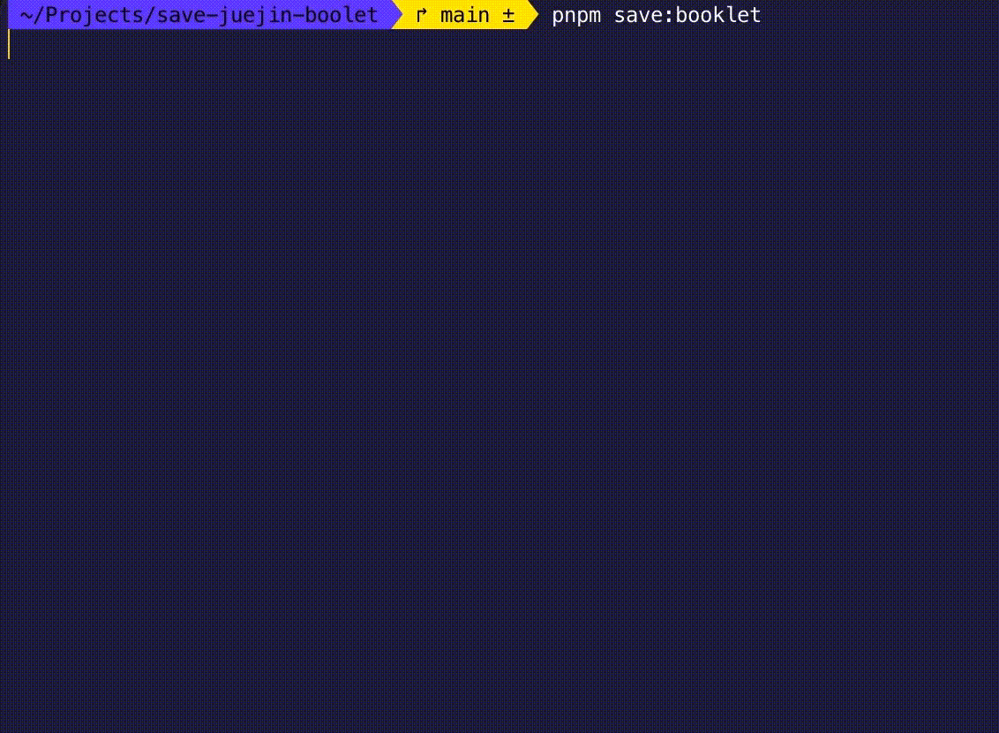

# save-juejin-booklet

Easily save the Juejin booklet.

## usage

1. Install Package

```shell
npm i
```

2. Save Cookies

```shell
npm run save:cookies
```

Then, login with WeChat.

3. Save Booklet

```shell
npm run save:booklet
```



## ⚠️ Disclaimer

Welcome to this project! This project is intended for learning and reference purposes only and may not be used for any commercial or other illegal purposes. We are not responsible for any infringement or other issues that may arise from your use of this project. Before using this project, please ensure that you have familiarized yourself with and comply with the relevant laws and regulations in your area. We reserve the right to change or terminate our services at any time without notice. By using this project, you agree to all the terms and conditions of this disclaimer. Thank you for your support and understanding of this project!
